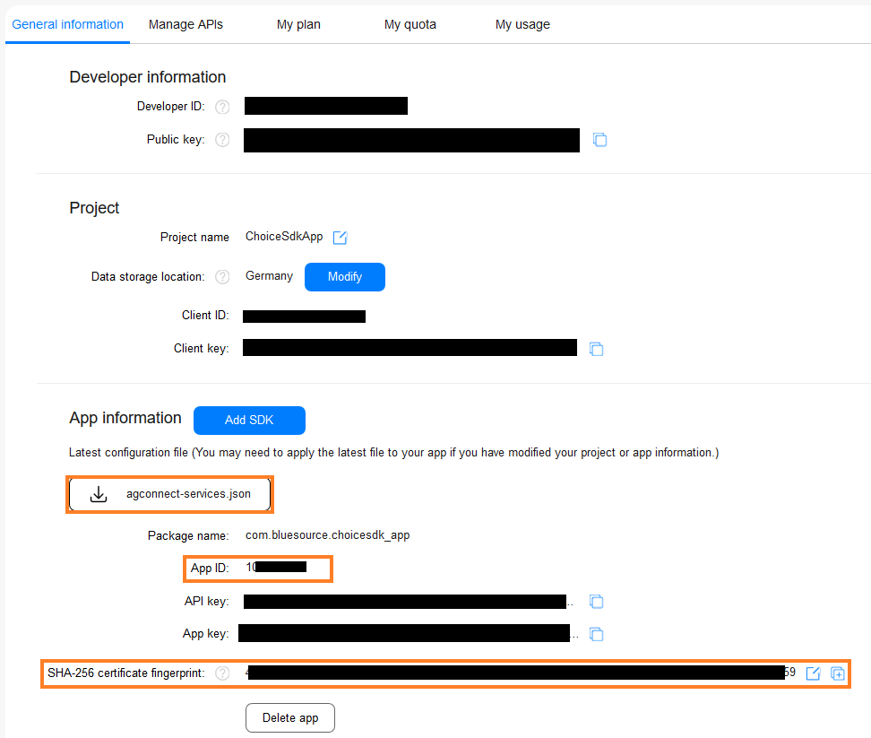

# How to set up the HMS core SDK

## Links & Information

The minimum Android version is 4.4. Not all Kits work on 4.4, for a complete list check out the [EMUI Version-Dependent Feature Site](https://developer.huawei.com/consumer/en/doc/HMSCore-Guides-V5/emui-version-dependent-0000001050042515-V5).

[Supported countries](https://developer.huawei.com/consumer/en/doc/HMSCore-Guides-V5/supported-regions-0000001050437657-V5)  
[Supported devices](https://developer.huawei.com/consumer/en/doc/HMSCore-Guides-V5/supported-devices-0000001050312738-V5)    
[HMS SDK Error codes](https://developer.huawei.com/consumer/en/doc/development/HMS-References/hms-error-code)

**Important notice:** The Huawei HMS Core application on the device needs all permissions, otherwise the SDK won't work.


## General integration

First steps:
- Log in to Huawei developer console
- Go to app gallery
- Create a project and app
- Under Project Setting add your package name
- Enable needed APIs by selecting "Manage APIs" under "Develop > Project Setting"
- Generate keystore in your Android project:
  - `keytool -genkey -v -keystore example.keystore -alias example -keyalg RSA -keysize 2048 -validity 1000`
- Add SHA-256 certificate fingerprint to your app under "Project Settings"
  - Use the command `keytool -list -v -keystore keystore` to display your keystore file
- The configuration will take effect in ~15 minutes
- Copy the generated keystore file to the `app` directory of the project (or where you normally store it)
- Configure the signing config in the app `build.gradle` file (fill in with what you set before)
  ```gradle
  android {
      signingConfigs {
          release {
              storeFile file("example.keystore")
              storePassword "xxx"
              keyAlias "example"
              keyPassword "xxx"
              v2SigningEnabled true
          }
      }
      buildTypes {
          release {
              minifyEnabled false
              proguardFiles getDefaultProguardFile('proguard-android-optimize.txt'), 'proguard-rules.pro'
              signingConfig signingConfigs.release
          }
          debug {
              signingConfig signingConfigs.release
          }
      }
  }
  ```
- Download the `agconnect-services.json` file (be sure to enable needed kits before) and add the file to the `app` directory of the project
  <p align="left">
    
  </p>


Project integration:
- Configure the maven repository in both `buildscript` and `allprojects` of project-level `build.gradle`
  ```gradle
  buildscript{
      repositories {
          maven { url 'http://developer.huawei.com/repo/' }
      }
      dependencies {
          classpath 'com.huawei.agconnect:agcp:1.5.0.300'
      }
  }
  
  allprojects {
      repositories {
          maven {url 'http://developer.huawei.com/repo/'}
      }
  }
  ```
- Add dependencies and plugin to app-level `build.gradle` file
  ```gradle
  apply plugin: 'com.huawei.agconnect'

  dependencies {
      // Add dependencies.
      implementation 'com.huawei.agconnect:agconnect-core:1.4.0.300'
  }
  ```
- If needed: Configure Proguard to prevent HMS from being obfuscated
  ```java
  -ignorewarnings
  -keepattributes *Annotation*
  -keepattributes Exceptions
  -keepattributes InnerClasses
  -keepattributes Signature
  -keepattributes SourceFile,LineNumberTable
  -keep class com.hianalytics.android.**{*;}
  -keep class com.huawei.updatesdk.**{*;}
  -keep class com.huawei.hms.**{*;}
  -keep class com.huawei.agconnect.**{*;}
  -keep interface com.huawei.hms.analytics.type.HAEventType{*;}
  -keep interface com.huawei.hms.analytics.type.HAParamType{*;}
  ```
- Lastly, before any development with HMS can take place you have to add the `appid` to your `AndroidManifest.xml`. The `appid` can be retrieved in the developer console where you download the `agconnect-services.json` file (see pictures above).
  ```xml
  <meta-data
      android:name="com.huawei.hms.client.appid"
      android:value="appid=YOURAPPID" />
  ```
